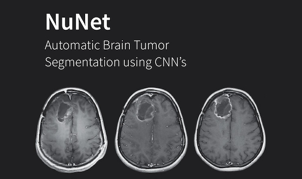
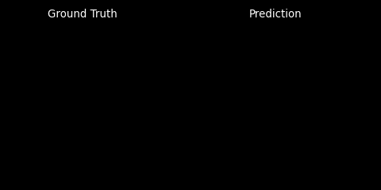
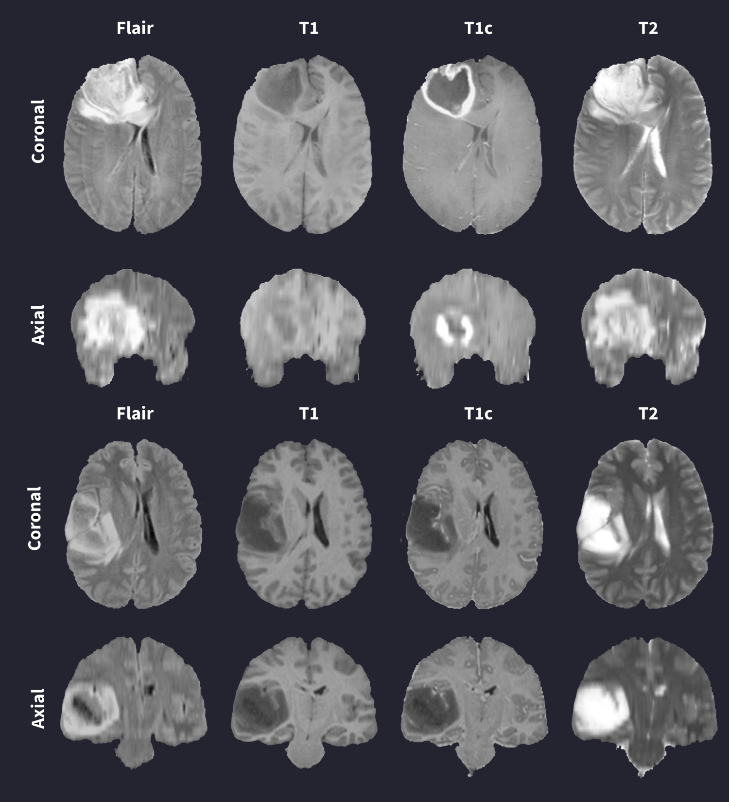
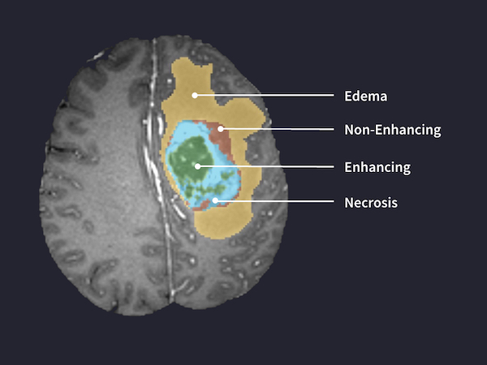

# Brain Tumor Segmentation using a 2D UNet



This project demonstrates the implementation of a 2D UNet Convolution Neural Network to segment regions of High-Grade Glioma brain tumors. The model implemented is based on this [paper](https://arxiv.org/abs/1505.04597).  The model was trained using data from the 2015 MICCAI BRaTS Challenge. For more information please see the [dataset](#dataset) section.



## Background / Overview

### What is Brain Tumor Segmentation?

Glioma tumors, the most common type of brain tumor, significantly reduce life expectancy in their high-grade form. While low grade gliomas (LGG) are usually removable surgically with a promising survival rate, high grade gliomas (HGG) are much more invasive. The segmentation of these HGG tumors aims to differentiate tissue regions, including regions of active tumor, necrosis, edema (swelling around a tumor) and non-tumor, in order to inform treatment. The segmentation process consists of going through each MRI slice and classifying each 3-D pixel (voxel) as a different tissue type. While segmentation is generally performed manually by radiologists, it is a highly laborious task that requires significant technical experience. Further, since HGG tumors have more undefined and irregular boundaries, segmenting them can provide additional challenges. Thus, an effective automatic segmentation method could provide a much more efficient alternative, saving radiologists and patients valuable time.

### Convolutional Neural Networks for Brain Tumor Segmentation

Since 2013, the Perelman School of Medicine at the University of Pennsylvania has been hosting the Multimodal Brain Tumor Segmentation Challenge (BraTS), aimed at developing algorithms to automatically segment gliomas. The current state-of-the-art method for automatic brain tumor segmentation uses different forms of a deep learning algorithm called a convolutional neural network (CNN). CNNs are commonly used due to their ability to 'learn' highly non-linear functions by fine-tuning millions of weights in the network. Specifically, they are often applied to image-processing tasks because they can extract high-level features, such as edges and orientations, in a hierarchical manner. CNN-based approaches to brain tumor segmentation vary in a number of features, including dimensionality, preprocessing techniques, input structure and the order and structure of the CNN layers. 

### Our UNet Approach

Our project explores a newer type of CNN-based deep learning algorithm called a UNet. Introduced in May 2015 by Olaf Ronneberger and a team of researchers from the University of Freiburg in Germany, the architecture immediately stood out compared to other architectures due to how well it performed in a number of different biomedical segmentation challenges. The network is made up of a contracting (encoder) path that reduces the dimensionality of the input and a subsequent expansive (decoder) path that increases it. One key feature of the UNet architecture is the incorporation of skip connections, which allow for the concatenation of features directly from the contracting to the expansive path and play a crucial role in restoring the spatial resolution lost from the input due to downsampling. Lastly, the fully convolutional nature (no dense, fully connected layers) of the UNet allows for variably-sized inputs, while the use of transposed convolutions in the decoder path enables precise localization of features. 

We first attempted this segmentation task by using a multi-pathway CNN where we first needed to create many smaller patches of pixels as input to the network to classify one at a time (the network would classify the central pixel of each patch). However, a UNet can classify slice by slice instead of patch by patch, which makes the UNet much more computationally efficient.


### Data Structure




All MRI scans of the brain used to validate our model were provided by the BRATS 2015 challenge database. This dataset consists of 220 HGG cases and 54 LGG cases. For the purposes of our experimentation, only HGG cases were utilized. Each MRI scan consists of 155 2D slices in four different modalities: T1, T1 with contrast, T2 and FLAIR. Thus, these four modalities sum to a total of 620 MRI slices for each patient. Further, each patient has a fifth image providing the 'ground truth' labels for each pixel. In this dataset, the voxel labels are as follows: '0' is non-tumor; '1' is necrosis; '2' is edema; '3' is non-enhancing tumor; '4' is enhancing tumor. There is a label for every pixel in each 240x240 voxel slice, generating 8,928,000 labels for each patient, and approximately 2 billion labels (1.96x109) for the 220 HGG cases overall. These ground truth segmentation labels are manually provided by radiologists.





## Installation

### Requirements

* GNU Make
* Python 3.7.9
* Tensorflow 2.4.0
* Keras 2.4.0
* CUDA 11.0
* scitkit-learn
* scikit-image
* SimpleITK
* tqdm

### Setup

1. Install [Tensorflow](tensorflow.org), it is recommended that you have version 2.4.0+
2. Install [Keras](keras.io), it is recommended  that you have version 2.4.0+
3. Install [CUDA](https://www.tensorflow.org/install/gpu) and configure GPU support for tensorflow. It is recommended that you have version 11.0+
4. Clone the project
```
git clone https://github.com/toehmler/nunet.git
```
5. Use pip to install all the dependencies
```
pip3 install -r requirements.txt
```
6. Download the dataset from the [MICCAI BRaTS Website](https://www.med.upenn.edu/cbica/brats2020/data.html) 
7. Run the preprocessing script to perform N4ITK bias correction and rename the patient directories. Bias correction is only performed on the t1 and t1c modalities. The corrected scans are saved with the `_n4` suffix. Set `n4itk=False` to skip bias correction. (Note: the current script expects `.mha` files)
```
python3 process.py <path_to_data> <n4itk=False>
```
8. Set `path_to_data`  in `config.ini`  to be the full path to the downloaded dataset.

## Usage 

The project relies on the values in `config.ini` to operate properly. Updating these values will change which model is being trained, tested or used for predictions. Additional parameters for training can be found here as well (batch size, validation split, etc.).  See [Configuration Options](#Configuration-Options) for a more detailed explanation of each option.

### Quick Start

To perform the entire pipeline on a new model from scratch (compile, train and test), perform the following steps:

1. Make sure `path_to_data` in `config.ini` is set as the full path to the data
2. Set `model_name` and `version_no` in `config.ini` to be the name and version number that new model willbe saved as. (Keeping the default will load a pre-trained model)
3. Update any of the training and testing options as needed
4. Run the pipeline using these options by simply running `make`. 

This will compile a new model and save a summary and its architecture in a new directory in `models/` under the name and version number given in the configuration file. The model will be trained and the results of the testing script will be saved as `.csv` in this directory. Due to the large file size of the MRI scans and limitations on RAM, training is done in groups. See [Training](#Training) for more information.

### Available Commands
* `make`: Runs the entire pipeline (see [Quick Start](#Quick-Start)). 
* `make train`: Runs the training script for the model specified in `config.ini`. Compiles a new model if one is not found using the given name and version number in `config.ini`, otherwise loads the model and resumes training. A training log is kept in the model's directory and training params are appended to this log on each run. See [Training](#Training) for more information.
* `make test`: Runs the test script, saving the result as a `.csv` in the model's directory. Assumes the model specified in `config.ini` can be found in `/models`. See [Testing](#Testing) for more information on the metrics used.
* `make predict`: Runs the prediction script, will show prompt for input of patient number to predict. Creates prediction images using t1c modality as background. Saves predictions as `.png` files and creates a `.gif` from these and saves these outputs in the directory specified as `image_out_path` in `config.ini`.

### Configuration Options

**General**
* `path_to_data` : Path to dataset in full, assumes patient directories have been renamed in the format `pat{x}`.
* `image_out_path` : Path to save prediction images in full.

**Model**
* `name` : Name of the current model being trained, tested or used for predictions. 
* `ver` : The version number of the current model being trained, tested, or used for predictions
If a model of a given name and version already exists when training, that model is loaded, otherwise a new model is compiled.

**Training**   
* `start` : The index of the patient to start training with
* `end` : The index of the patient to end training with
* `interval` : How many patients to train in each group (if not an even divisor of the total number the last group will be the size of the remainder)
* `epochs` : Number of epochs to train for *per group*
* `batch_size` : The batch size to train the model using *per group*   
* `validation_split` : The split to use to create the validation data (0-1), done on *per group* basis

**Testing**
* `start` : The start index of the patient to test on
* `end` : The end index of the patient to test on


## Training and Testing
Data was trained 40 patients at a time for 5 times. The trained model was subsequently tested on the remaining 20 files that were not trained on (testing set). Models were evaluated based on the Dice (F1) Score (the harmonic mean of recall and precision). A separate dice score can be generated for each class.


## Results

Results on each of the 20 test set files are shown in the table below. Averages are presented in the bottom row.


|   Patient Number  |   dice_whole          |   dice_enhancing       |   dice_core            |   sen_whole           |   sen_enhancing       |   sen_score            |   spec_whole          |   spec_enhancing      |   spec_core           |
|-------------------|-----------------------|------------------------|------------------------|-----------------------|-----------------------|------------------------|-----------------------|-----------------------|-----------------------|
|   1               |   0.9067465108417440  |   0.8603748397182560   |   0.8481874100248660   |   0.9572544992388990  |   0.9324931465123360  |   0.9757393268093340   |   0.9975923416329010  |   0.9993062027451730  |   0.998298486574066   |
|   2               |   0.8188783348696780  |   0.789805088869172    |   0.8000930882010710   |   0.9109086721008170  |   0.9698790946154930  |   0.9127837514934290   |   0.9951964076771500  |   0.9984458761276420  |   0.9978081791098390  |
|   3               |   0.8318866532746310  |   0.8588792113591170   |   0.7455067303117280   |   0.7657232167258810  |   0.8327359617682200  |   0.767281688360925    |   0.99900055749053    |   0.9997801244636960  |   0.9989641817069210  |
|   4               |   0.9062616184353730  |   0.9108634251526100   |   0.8903131217928580   |   0.9464261762733400  |   0.9119435660423260  |   0.9221624435959740   |   0.9977072377649640  |   0.9998331380064270  |   0.9996133611949850  |
|   5               |   0.93814154725519    |   0.8991446261765860   |   0.8652247085956490   |   0.9594845854680380  |   0.8319976155782220  |   0.7860022650056630   |   0.9987967977147110  |   0.9999367259606980  |   0.9998465755275020  |
|   6               |   0.8146383496375890  |   1                    |   0.26611570247933900  |   0.7699530516431930  |   1                   |   0.16246215943491400  |   0.999859154345195   |   1.0                 |   0.999993502863053   |
|   7               |   0.9428732656935740  |   0.9080912264126180   |   0.9326917128438990   |   0.9586354915287310  |   0.8660751160782450  |   0.9498672426983480   |   0.9981520171087340  |   0.9996262473162310  |   0.9989041493632400  |
|   8               |   0.8966631576370360  |   0.7966937912475170   |   0.838424917068025    |   0.8852419393822210  |   0.796285622798591   |   0.9207670264008290   |   0.9989534894921170  |   0.9996448762031710  |   0.9989834964887800  |
|   9               |   0.8730306946446850  |   0.837285986049461    |   0.8538828505385330   |   0.803849010922497   |   0.7411315671306690  |   0.7729039916901620   |   0.9996908068450710  |   0.9999416398134990  |   0.9998582238859590  |
|   10              |   0.6950227193747420  |   0.23311092577147600  |   0.4072045152722440   |   0.622921147585299   |   0.1522331154684100  |   0.38057559537661900  |   0.9983681855206830  |   0.9999366899109940  |   0.9992934466645330  |
|   11              |   0.7220187762167920  |   0.44165395297891500  |   0.5930115335326780   |   0.811572509943121   |   0.6917892156862750  |   0.7663737137305130   |   0.9977015581393310  |   0.998681814920447   |   0.9979193422565770  |
|   12              |   0.9422471332707900  |   0.9011150522252050   |   0.8996173281969710   |   0.9489153001353990  |   0.8581479546133170  |   0.926873255752725    |   0.9987627006930630  |   0.9997193054731710  |   0.9988524673871640  |
|   13              |   0.8803250597576130  |   0.9065298591422530   |   0.7761389708292360   |   0.9348696012142960  |   0.9479529411764710  |   0.9688279301745640   |   0.9962439194011660  |   0.999657787632975   |   0.9984787139016100  |
|   14              |   0.9174707098552720  |   0.8162194610507620   |   0.8261158311768610   |   0.9328467153284670  |   0.7392418261711480  |   0.7778592375366570   |   0.9970176880162610  |   0.9994534393651180  |   0.9986143989033210  |
|   15              |   0.7475480369627930  |   0.8980303294404740   |   0.77128867590374     |   0.6235359368372970  |   0.8647777628575270  |   0.6536587088571830   |   0.9996910913171960  |   0.9998977909608620  |   0.9998685346580850  |
|   16              |   0.9297033337056960  |   0.8995521851403920   |   0.9218140403321700   |   0.9649134430009080  |   0.8446277745040270  |   0.9350894699619260   |   0.9980940084827960  |   0.999693778723081   |   0.9989038821473300  |
|   17              |   0.9424610018471540  |   0.9016432035406560   |   0.8679654086278050   |   0.9293538727581360  |   0.9689579274926     |   0.8297594674520790   |   0.9992318750969850  |   0.9991979499740840  |   0.9992236963248360  |
|   18              |   0.7858073358392250  |   0.6131779062884200   |   0.5145884812773240   |   0.9350864303188350  |   0.9146855046868630  |   0.8645217946670920   |   0.9937418099637860  |   0.9991181125029270  |   0.9978988217564200  |
|   19              |   0.866457374888163   |   0.8095846165402240   |   0.7969931198505050   |   0.8505045885862170  |   0.7193485950744180  |   0.7476494023904380   |   0.9987725015435730  |   0.9999029509312050  |   0.9996376461602400  |
|   20              |   0.5015015015015020  |   0.7430449069003290   |   0.7184656306873860   |   0.3997449068735370  |   0.7507746790615320  |   0.6427855711422850   |   0.9987454296506070  |   0.9998632820685920  |   0.9998031633831400  |
|   Mean Values     |   0.842984155775462   |   0.801240029700222    |   0.7566821888771440   |   0.8455870547932560  |   0.8167539493658350  |   0.783197202126583    |   0.998065978894841   |   0.9995818866550000  |   0.99903821351288    |


